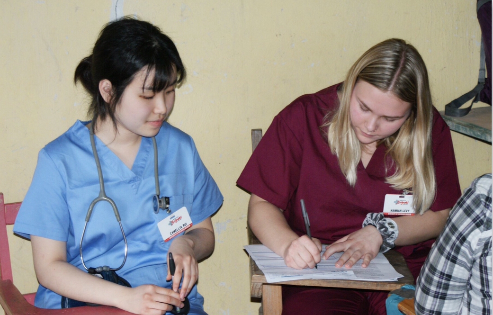
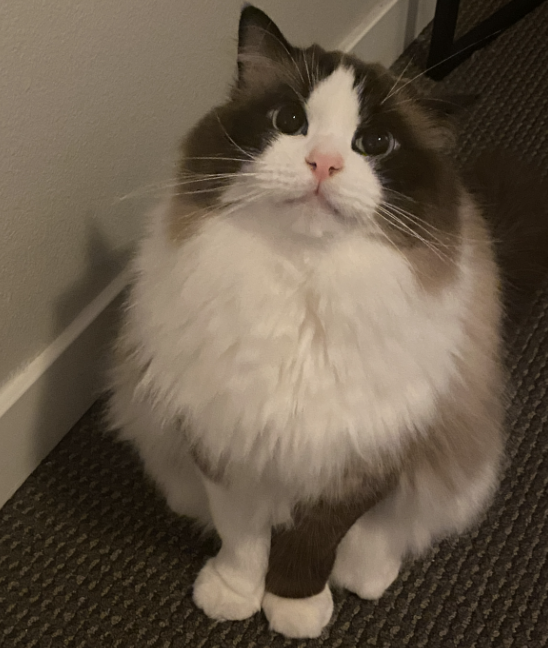

My name is Xinyue Rui and I’m from Anhui, China. My parents gave me my first name as it pronounce like “star and moon” and means “mysterious gem on the moon”. I came to the US in 2017 and named myself “Camellia” as people were having a hard time pronouncing my Chinese name. 

I went to University of Wisconsin-Madison in 2017 where I studied biochemistry. I was fortunate to be advised by [Prof. David Abbot](https://erp.wisc.edu/staff/abbott-david/), an exceptional researcher in Obstetrics&Gynecology, at when I established my interests in biomedical research. Dave not only made me decide to pursue a career in scientific research because I wanted to be a person like him, but also gave me determination and courage to be an aspiring researcher. 

When I transferred to USC at 2019, I decided to develop my strength in mathematics and found a field that can combine my mathematical skills with my interests in biomedical research - Biostatistics. I changed my major to mathematics and started my undergraduate research on population genetics with Prof. Charleston Chiang at USC Department of population and public health sciences. I was working with a group of five on a project of comparing genotype imputation quality of a large collection of diverse populations all over the world, and our project demonstrated that underrepresented populations such as East Asian and Southeast Asian had a huge gap of imputation accuracy compared to European counterparts. 

At 2022, I graduated with a bachelor in Mathematics with and a master in Biostatistics at USC. At the same time, I started my PhD in Biostatistics at USC and was selected for Keck School of Medicine Fellowship. I have a lot passion and interests in statistical genetics, and determined to develop statistical tool that better infer the disease mechanism from genetic architecture. I am very fortunate to be co-advised by Prof. Nicholas Mancuso and Prof. Steven Gazal, who were very supportive on my research and career development. 

  
  <figcaption>Graduation</figcaption>

Beyond research experience, I also love to volunteer. I did medical volunteering in global brigades during January 2019 in Honduras and January 2020 in Panama, where I established my entry-level Spanish proficiency. While helping people in the rural area of Honduras and Panama, I realized the huge gap of medical and public health resources between rural and urban, developing country and developed country. I always bear in mind that there are people in need of help and, we, as public health researchers, can utilize our strength and expertise to save them. It is the motivation of all of what I’m doing.

  
  <figcaption>Medical Volunteer</figcaption>

In my free time, I enjoy spending time with my cat, Pork Chop. In 2022, he proudly earned dual master’s degrees in Meowology and Purrology. His primary role in our little team is to provide emotional support and help enhance my focus and concentration skills.

  
  <figcaption>Pork chop, M.S. in Meowology and Purrology</figcaption>

